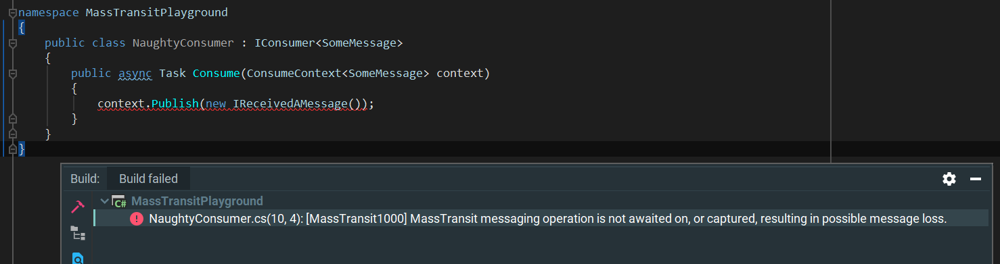

# MassTransit.Analyzers  
Code Analyzers for [MassTransit](https://github.com/MassTransit/MassTransit).

**Package** [MassTransit.Analyzers](https://www.nuget.org/packages/MassTransit.Analyzers) | **Platforms** .NET Standard 2.0

For rules, see https://jokokko.github.io/masstransit.analyzers/.

Note: This is a contributor project.

Idea for the analyzer from [NServiceBus](https://particular.net/blog/classic-rock-and-async-await-stop-breaking-the-rules).